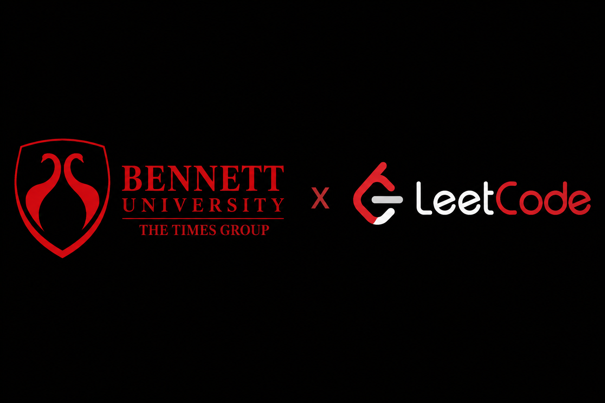
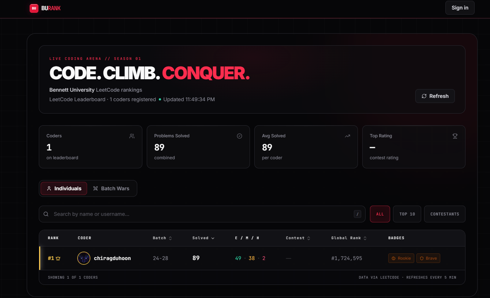
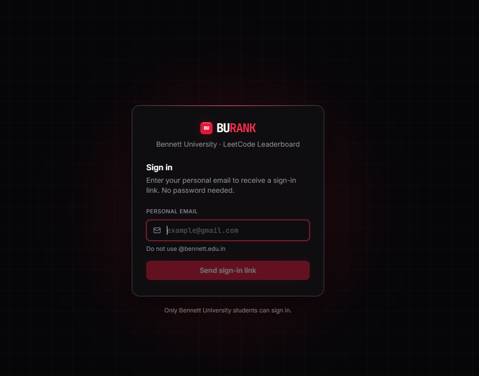
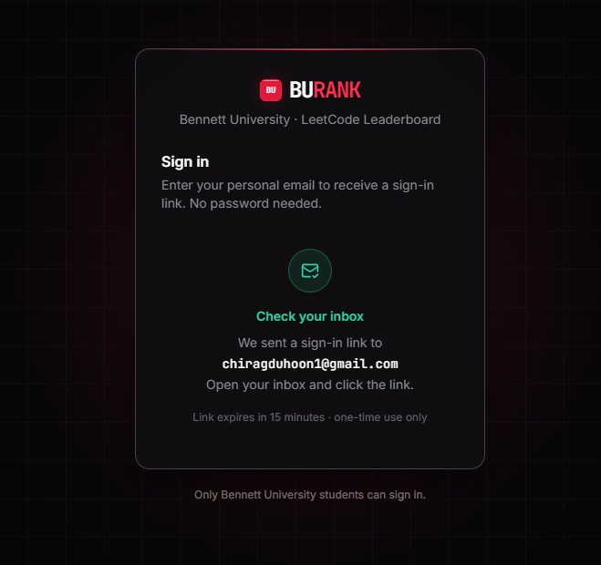

<div align="center">



# 🏆 BURank

### The modern LeetCode leaderboard platform for universities.

Track competitive programming progress, compare batches, discover top performers, and foster healthy coding competition — all in one place.

**[🌐 Live Demo — bu-rank-three.vercel.app](https://bu-rank-three.vercel.app)**

[Live Demo](https://bu-rank-three.vercel.app) • [Report Bug](https://github.com/chiragduhoon/BURank/issues) • [Request Feature](https://github.com/chiragduhoon/BURank/issues)

</div>

---

> **Unofficial student-made project** — not affiliated with or endorsed by Bennett University or LeetCode.

## Overview

BURank lets a university run an engaging LeetCode leaderboard for its students.

It aggregates live LeetCode statistics, ranks students and batches, tracks contest performance, verifies students by enrollment number, and gives admins a panel for managing members and weekly challenges.

---

## ✨ Features

### Live Leaderboard

- Real-time LeetCode rankings, fetched from LeetCode's GraphQL API
- Easy / Medium / Hard problem breakdown
- Contest rating and global ranking
- Dynamic sorting and filtering

### Batch Wars

- Compare academic batches head to head
- Average solved problems per batch
- Competitive batch rankings

### Student Profiles

- Individual coding statistics
- Contribution heatmaps
- Contest history and badges

### Passwordless Authentication

- Secure email magic links (NextAuth)
- Gmail SMTP or Resend as the mail transport — or a dev mode that
  shows the link on-page when no mail service is configured
- Student verification via university enrollment-number validation
  (format + batch-year consistency + uniqueness)

### Admin Dashboard

- Member management (add / remove)
- Question of the Week with automatic First Blood detection
- Password-protected access

---

## Tech Stack

| Category | Technology |
|-----------|------------|
| Framework | Next.js 14 |
| Language | TypeScript |
| Styling | Tailwind CSS |
| Authentication | NextAuth.js (email magic links) |
| ORM | Prisma |
| Database | SQLite (local) / PostgreSQL (production) |
| Email | Gmail SMTP or Resend |
| Deployment | Vercel |

---

## Screenshots

### Leaderboard

<p align="center">
  
</p>

### Passwordless Sign-in

<p align="center">
  
  
</p>

---

## Getting Started

```bash
git clone https://github.com/chiragduhoon/BURank.git
cd BURank
npm install
cp .env.local.example .env.local   # then fill in the values
npx prisma db push                 # creates the local SQLite database
node prisma/seed.mjs               # optional: seed demo members
npm run dev
```

Open http://localhost:3000. The admin panel lives at `/admin`
(password = `ADMIN_PASSWORD` from `.env.local`).

With no email credentials configured, sign-in runs in dev mode: the
magic link appears directly on the sign-in page. Add `GMAIL_USER` +
`GMAIL_APP_PASSWORD` (or a `RESEND_API_KEY`) to send real emails.

---

## Architecture

```text
                 LeetCode GraphQL
                        │
                        ▼
              Next.js API Routes
                        │
        ┌───────────────┼───────────────┐
        ▼                               ▼
   Prisma ORM                    Authentication
 (SQLite / Postgres)         NextAuth + Gmail SMTP
        │                               │
        └───────────────┬───────────────┘
                        ▼
                 BURank Frontend
                  (Next.js + React)
                        │
                        ▼
                     Vercel
```

---

## Contributing

Contributions are welcome — see [CONTRIBUTING.md](./CONTRIBUTING.md) to get
started. Issues labeled
[`good first issue`](https://github.com/chiragduhoon/BURank/issues?q=is%3Aissue+is%3Aopen+label%3A%22good+first+issue%22)
are a great entry point. Want BURank for your own university? That's a
contribution we'd especially love.

---

## License

Distributed under the MIT License — see [LICENSE](./LICENSE).

---

<div align="center">

Made with ❤️ for the competitive programming community.

If you found this project useful, consider giving it a ⭐.

</div>
